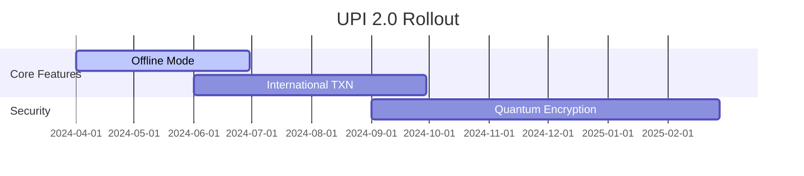

## Expected Features

- **Offline UPI payments**
- **Cross-border transactions**
- **Smart contract integration**
- **Enhanced security protocols**
- **Voice-enabled payments**

### Key Benefits

1. Faster transaction processing
2. Lower failure rates
3. Improved interoperability
4. Better merchant onboarding
5. Enhanced user experience

### Development Timeline

